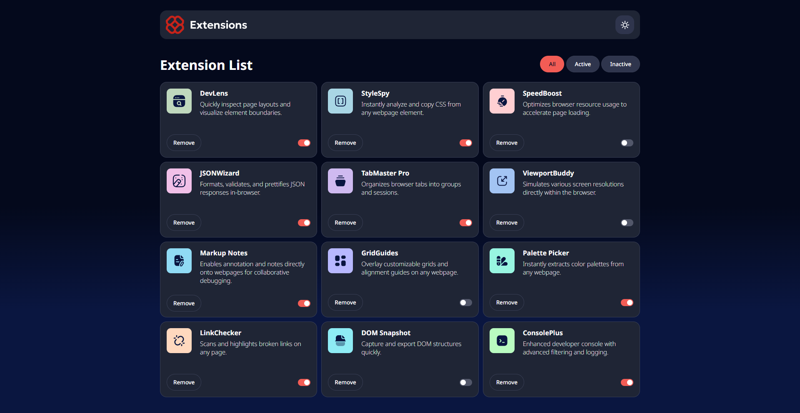

# Frontend Mentor - Browser extensions manager UI solution

This is a solution to the [Browser extensions manager UI challenge on Frontend Mentor](https://www.frontendmentor.io/challenges/browser-extension-manager-ui-yNZnOfsMAp). Frontend Mentor challenges help you improve your coding skills by building realistic projects.

## Overview

### The challenge

Users should be able to:

- Toggle extensions between active and inactive states
- Filter active and inactive extensions
- Remove extensions from the list
- Select their color theme
- View the optimal layout for the interface depending on their device's screen size
- See hover and focus states for all interactive elements on the page

### Screenshot

### Links

- Solution URL: [Add solution URL here](https://your-solution-url.com)
- Live Site URL: [Add live site URL here](https://your-live-site-url.com)

## My process

### Built with

- Semantic HTML5 markup
- Scss
- Flexbox
- CSS Grid

### What I learned

I learned the basics of using Sass in order to speed up writing css.

### Continued development

I plan to continue learning sass in order to better understand its benifits and make the process more streamlined.

## Author

- Website - [Tom Bazzoni](http://tom-bazzoni.co.uk/)
- Frontend Mentor - [@GregsGrog](https://www.frontendmentor.io/profile/GregsGrog)